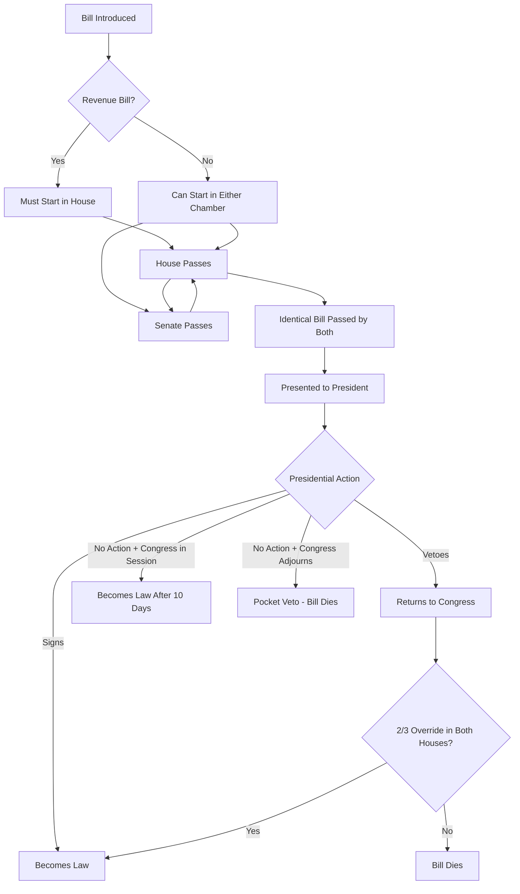
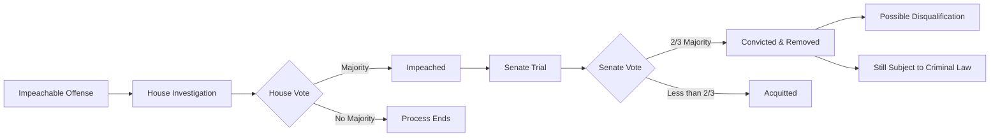
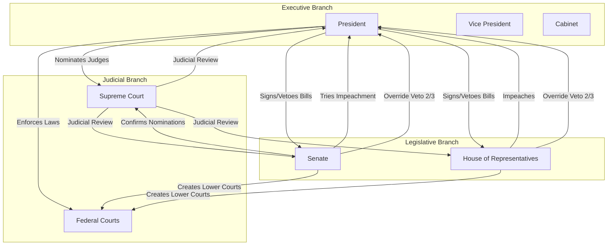
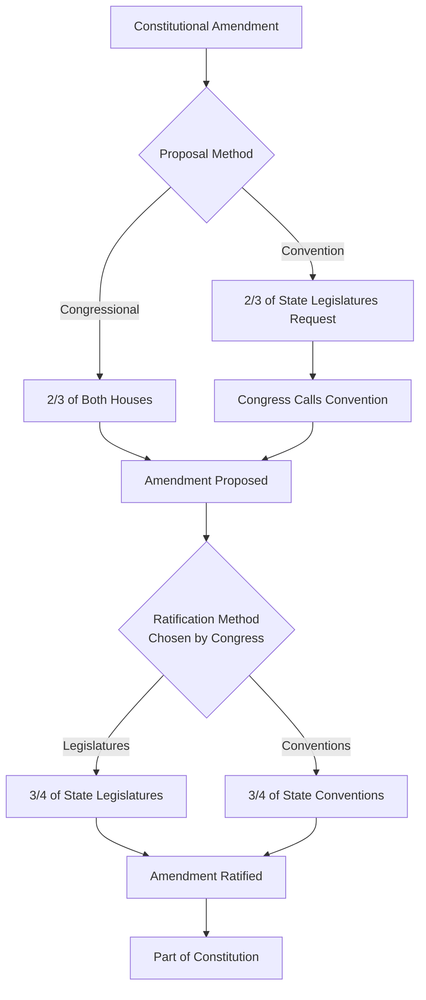
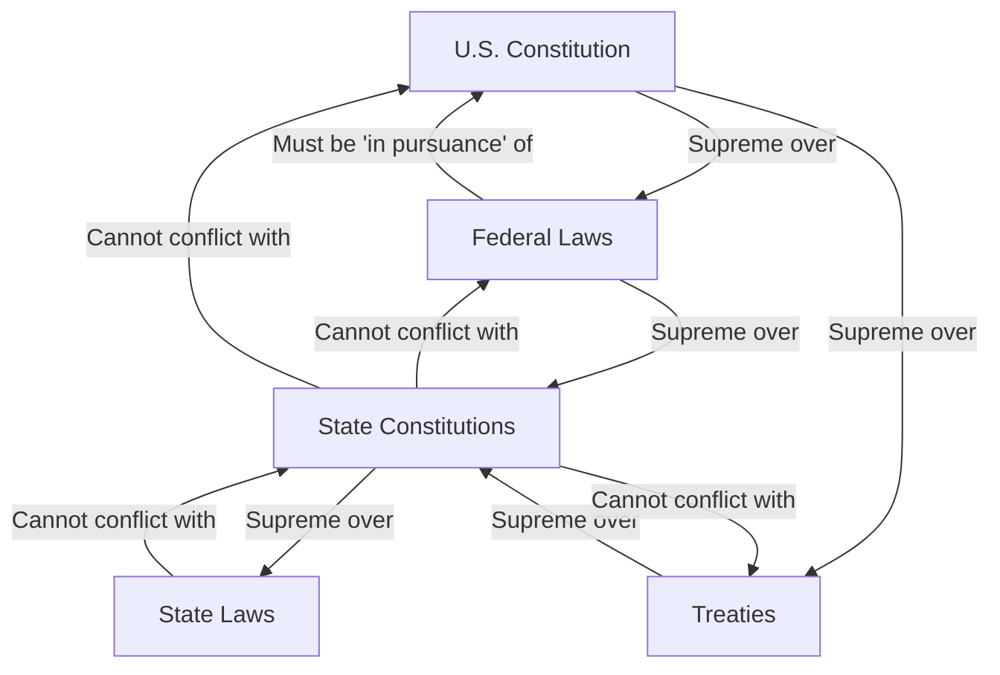

## Article I - Legislative Branch

### Section 1. Vesting of Legislative Powers

```python
from dataclasses import dataclass
from typing import List, Dict, Optional, Union, Literal
from enum import Enum
import math

# Type definitions
State = str

class Branch(Enum):
    EXECUTIVE = "executive"
    JUDICIAL = "judicial"
    LEGISLATIVE = "legislative"

@dataclass
class Officer:
    title: str
    duties: List[str]

@dataclass
class Official:
    name: str
    position: str
    branch: Branch

@dataclass
class LegislativeChamber:
    members: List['Member']
    powers: List[str]

@dataclass
class Congress:
    Senate: LegislativeChamber
    HouseOfRepresentatives: LegislativeChamber

# Initialize the United States government structure
UnitedStates = {
    "Congress": Congress(
        Senate=LegislativeChamber(
            members=[],
            powers=["try impeachments", "confirm appointments", "ratify treaties"]
        ),
        HouseOfRepresentatives=LegislativeChamber(
            members=[],
            powers=["originate revenue bills", "impeach officials"]
        )
    )
}
```

All legislative powers defined in this spec are granted to the `Congress` namespace, composed of two modules: `Senate` and `HouseOfRepresentatives`.

### Section 2. House of Representatives

```python
@dataclass
class Representative:
    age: int
    citizenship_years: int
    state_of_residence: State

def is_representative_eligible(rep: Representative, state: State) -> bool:
    return (rep.age >= 25 and
            rep.citizenship_years >= 7 and
            rep.state_of_residence == state)

@dataclass
class Apportionment:
    state: State
    representatives: int
    direct_taxes: float

def compute_census_apportionment(state_populations: Dict[State, int]) -> List[Apportionment]:
    total_population = sum(state_populations.values())
    representatives_per_person = 435 / total_population  # Total House seats
    
    apportionments = []
    for state, population in state_populations.items():
        apportionments.append(Apportionment(
            state=state,
            representatives=max(1, math.floor(population * representatives_per_person)),
            direct_taxes=population * representatives_per_person
        ))
    return apportionments

def apportion(state_populations: Dict[State, int]) -> List[Apportionment]:
    # Note: three_fifths_compromise() is deprecated and retained only for historical context
    return compute_census_apportionment(state_populations)

def issue_writ_of_election(state: State) -> None:
    print(f"Writ of election issued for {state}")
    # Implementation would trigger state election process

def handle_vacancy(state: State) -> None:
    issue_writ_of_election(state)

class ImpeachmentMotion:
    def __init__(self, target: Official, charges: List[str]):
        self.target = target
        self.charges = charges
    
    @property
    def valid(self) -> bool:
        return len(self.charges) > 0

class HouseOfRepresentatives:
    def __init__(self):
        self.speaker: Optional[Representative] = None
        self.officers: List[Officer] = []
    
    def impeach(self, target: Official, charges: List[str]) -> ImpeachmentMotion:
        return ImpeachmentMotion(target, charges)
```

* Members of `HouseOfRepresentatives` are elected every 2 years by state-eligible voters.
* Eligibility is determined by age ≥ 25, U.S. citizenship ≥ 7 years, and current residence in the elected state.
* `Apportionment` is calculated decennially, based on population and a legacy clause involving fractional representation.
* Vacancies are filled by the respective state's executive issuing special elections.
* The House selects a `Speaker`, other `Officers`, and holds the **sole power of impeachment**.

### Section 3. Senate

```python
@dataclass
class Senator:
    state: State
    term_length: int  # years
    senate_class: Literal[1, 2, 3]
    age: int
    citizenship_years: int
    residence: State

@dataclass
class VicePresident:
    name: str
    tie_breaking_votes_cast: int

@dataclass
class ChiefJustice:
    name: str
    court: Literal["Supreme"]

@dataclass
class President(Official):
    term: int

Verdict = Literal["guilty", "not guilty"]
Member = Union[Representative, Senator]
PresidingOfficer = Union[VicePresident, ChiefJustice]

class SenateStructure:
    def __init__(self):
        self.senators: List[Senator] = []
        self.president: Optional[VicePresident] = None
        self.president_pro_tempore: Optional[Senator] = None
        self.officers: List[Officer] = []
    
    def vote(self, motion: ImpeachmentMotion) -> Verdict:
        # Requires 2/3 majority for conviction
        votes_needed = math.ceil(len(self.senators) * 2 / 3)
        # Actual implementation would count votes
        return "not guilty"  # placeholder

# Initialize Senate
Senate = SenateStructure()

def is_senator_eligible(s: Senator) -> bool:
    return (s.age >= 30 and
            s.citizenship_years >= 9 and
            s.residence == s.state)

def elect_senators(state: State) -> List[Senator]:
    # Pre-17th Amendment: chosen by state legislatures
    # Post-17th Amendment: direct election
    return []  # placeholder

def try_impeachment(senate: SenateStructure, motion: ImpeachmentMotion) -> Verdict:
    if not motion.valid:
        raise ValueError("Invalid impeachment motion")
    return senate.vote(motion)

def preside_during_impeachment(target: Official, chief_justice: ChiefJustice) -> PresidingOfficer:
    if isinstance(target, President):
        return chief_justice
    elif Senate.president is not None:
        return Senate.president
    else:
        raise ValueError("No presiding officer available")
```

* Each state elects **2 Senators**, serving **6-year terms**, staggered into **three classes**.
* Initially chosen by state legislatures (pre-17th Amendment).
* Eligibility: age ≥ 30, U.S. citizenship ≥ 9 years, residency in the represented state.
* The **Vice President** acts as Senate President (only votes to break ties).
* Senate also elects a **President pro tempore** and other **Officers**.
* Holds **exclusive authority to try impeachments**.

  * When the President is tried, the **Chief Justice** presides.
  * **Conviction requires a 2/3 majority**.
  * **Judgment limited to removal and disqualification**, but does not bar further prosecution under law.

### Section 4. Elections and Meetings

```python
from datetime import datetime, timedelta
from typing import Tuple

@dataclass
class ElectionRegulation:
    state_controlled: List[str] = None
    congress_controlled: List[str] = None
    
    def __post_init__(self):
        if self.state_controlled is None:
            self.state_controlled = ["times", "places", "manner"]
        if self.congress_controlled is None:
            self.congress_controlled = ["alterations", "regulations"]

def regulate_elections(chamber: Literal["Senate", "House"]) -> ElectionRegulation:
    # States prescribe regulations, but Congress may alter
    return ElectionRegulation()

def congressional_assembly_requirement() -> datetime:
    # Must meet at least once per year
    # Originally first Monday in December (changed by 20th Amendment)
    return datetime(datetime.now().year, 12, 1)
```

* **Election regulations**: Times, places, and manner prescribed by state legislatures
* **Congressional override**: Congress may alter such regulations (except Senate places)
* **Annual assembly**: Congress must meet at least once yearly

### Section 5. Rules and Discipline

```python
@dataclass
class ChamberRules:
    quorum_percentage: float
    journal_public: bool
    adjournment_limit_days: int = 3

class LegislativeHouse:
    def __init__(self, name: str):
        self.name = name
        self.members: List[Member] = []
        self.rules = ChamberRules(
            quorum_percentage=0.51,  # Majority constitutes quorum
            journal_public=True
        )
    
    def judge_member_qualification(self, member: Member) -> bool:
        # Each house judges elections, returns, and qualifications
        if self.name == "House":
            return is_representative_eligible(member, member.state_of_residence)
        else:
            return is_senator_eligible(member)
    
    def has_quorum(self) -> bool:
        present_count = sum(1 for m in self.members if m.present)
        return present_count >= len(self.members) * self.rules.quorum_percentage
    
    def compel_attendance(self) -> None:
        # Smaller number may compel attendance of absent members
        print("Sergeant-at-Arms dispatched to compel attendance")
    
    def punish_member(self, member: Member, offense: str) -> str:
        # Each house may punish members for disorderly behavior
        if offense == "severe":
            return self.expel_member(member)
        return "censure"
    
    def expel_member(self, member: Member) -> str:
        # Requires 2/3 vote
        required_votes = math.ceil(len(self.members) * 2 / 3)
        return f"Expulsion requires {required_votes} votes"
    
    def keep_journal(self, proceedings: List[str]) -> Dict[str, any]:
        # Must publish journal except parts requiring secrecy
        return {
            "public": [p for p in proceedings if not self._requires_secrecy(p)],
            "secret": [p for p in proceedings if self._requires_secrecy(p)]
        }
    
    def _requires_secrecy(self, proceeding: str) -> bool:
        # 1/5 of present members can require secrecy
        return "national_security" in proceeding
```

* **Self-governance**: Each house judges its members' qualifications and elections
* **Quorum**: Majority required for business; attendance can be compelled
* **Rules**: Each house determines its proceedings
* **Discipline**: Members can be punished or expelled (2/3 vote)
* **Journal**: Proceedings must be published (except secret parts)
* **Adjournment**: Limited to 3 days without other house's consent

### Section 6. Compensation and Privileges

```python
@dataclass
class CongressionalCompensation:
    salary: float
    paid_from: str = "Treasury of the United States"

@dataclass
class CongressionalPrivileges:
    arrest_immunity: List[str]
    speech_immunity: bool = True
    
    def __post_init__(self):
        # Privileged from arrest except for treason, felony, breach of peace
        self.arrest_immunity = ["civil_arrests_during_session", "traveling_to_session"]

class CongressionalRestrictions:
    @staticmethod
    def can_hold_civil_office(member: Member, office: str, when_created: datetime) -> bool:
        # No member can be appointed to civil office created during their term
        # or whose salary was increased during their term
        return False
    
    @staticmethod
    def can_be_member_while_holding_office(office: str) -> bool:
        # No person holding US office can be member of Congress
        return office not in ["executive", "judicial"]
```

* **Compensation**: Paid from U.S. Treasury as prescribed by law
* **Arrest privilege**: Immune from arrest during attendance (except serious crimes)
* **Speech immunity**: Cannot be questioned elsewhere for speeches in Congress
* **Office restrictions**: Cannot hold other federal offices while serving
* **Appointment restrictions**: Cannot be appointed to offices created/enhanced during term

### Section 7. Legislative Process

```python
from enum import Enum
from typing import Optional

class BillType(Enum):
    REVENUE = "revenue"
    GENERAL = "general"

@dataclass
class Bill:
    bill_type: BillType
    title: str
    text: str
    originated_in: Literal["House", "Senate"]
    
    def __post_init__(self):
        if self.bill_type == BillType.REVENUE and self.originated_in != "House":
            raise ValueError("Revenue bills must originate in House")

class LegislativeProcess:
    @staticmethod
    def pass_bill(bill: Bill) -> "PassedBill":
        # Must pass both houses in identical form
        return PassedBill(bill)
    
    @staticmethod
    def present_to_president(passed_bill: "PassedBill") -> Union["Law", "VetoedBill"]:
        # President has 10 days (excluding Sundays) to act
        return Law(passed_bill)  # or VetoedBill
    
    @staticmethod
    def override_veto(vetoed_bill: "VetoedBill") -> Optional["Law"]:
        # Requires 2/3 vote in both houses
        house_override = vetoed_bill.house_votes >= math.ceil(435 * 2 / 3)
        senate_override = vetoed_bill.senate_votes >= math.ceil(100 * 2 / 3)
        
        if house_override and senate_override:
            return Law(vetoed_bill.bill)
        return None

@dataclass
class PassedBill:
    bill: Bill
    house_votes: int
    senate_votes: int

@dataclass
class VetoedBill:
    bill: Bill
    veto_message: str
    house_votes: int = 0
    senate_votes: int = 0

@dataclass
class Law:
    original_bill: Bill
    enactment_date: datetime
    public_law_number: str

def pocket_veto(bill: PassedBill, congress_adjourns: bool) -> Union[Law, None]:
    # If Congress adjourns within 10 days, bill doesn't become law
    if congress_adjourns:
        return None  # Pocket veto
    return Law(bill)  # Becomes law without signature
```

### Legislative Process



* **Revenue bills**: Must originate in the House of Representatives
* **Senate amendments**: Senate may propose amendments to any bill
* **Presidential action**: Sign into law, veto with objections, or no action
* **Veto override**: Requires 2/3 vote in both houses
* **Pocket veto**: If Congress adjourns, unsigned bills don't become law
* **Joint resolutions**: Subject to same process as bills

### Section 8. Powers of Congress

```python
from decimal import Decimal
from typing import Set

class CongressionalPowers:
    """Enumerated powers of Congress"""
    
    # Fiscal Powers
    @staticmethod
    def lay_and_collect_taxes(purpose: List[str]) -> bool:
        valid_purposes = ["pay_debts", "provide_for_common_defense", "general_welfare"]
        return all(p in valid_purposes for p in purpose)
    
    @staticmethod
    def borrow_money(amount: Decimal, purpose: str) -> "Bond":
        return Bond(amount=amount, purpose=purpose, backing="full_faith_and_credit")
    
    # Commerce Powers
    @staticmethod
    def regulate_commerce(scope: Literal["foreign", "interstate", "indian_tribes"]) -> "Regulation":
        return Regulation(scope=scope)
    
    # Immigration and Bankruptcy
    @staticmethod
    def establish_naturalization_rules() -> "NaturalizationProcess":
        return NaturalizationProcess(uniform=True)
    
    @staticmethod
    def establish_bankruptcy_laws() -> "BankruptcyCode":
        return BankruptcyCode(uniform=True)
    
    # Monetary Powers
    @staticmethod
    def coin_money(denomination: Decimal) -> "Currency":
        return Currency(value=denomination, issuer="United States")
    
    @staticmethod
    def regulate_currency_value(foreign: bool = False) -> None:
        pass  # Set exchange rates and monetary policy
    
    @staticmethod
    def fix_standard_of_weights_and_measures() -> Dict[str, str]:
        return {"length": "meter", "mass": "kilogram", "time": "second"}
    
    @staticmethod
    def punish_counterfeiting() -> "CriminalStatute":
        return CriminalStatute(crime="counterfeiting", punishment="fine_and_imprisonment")
    
    # Infrastructure
    @staticmethod
    def establish_post_offices() -> "PostalService":
        return PostalService(universal_service=True)
    
    @staticmethod
    def establish_post_roads() -> Set[str]:
        return {"interstate_highways", "mail_routes"}
    
    # Intellectual Property
    @staticmethod
    def grant_copyright(author: str, work: str, term_years: int = 14) -> "Copyright":
        # Originally 14 years with one renewal
        return Copyright(author=author, work=work, term=term_years)
    
    @staticmethod
    def grant_patent(inventor: str, invention: str, term_years: int = 17) -> "Patent":
        return Patent(inventor=inventor, invention=invention, term=term_years)
    
    # Judicial
    @staticmethod
    def constitute_tribunals() -> List["Court"]:
        # Federal courts inferior to Supreme Court
        return [Court(level="district"), Court(level="circuit")]
    
    # Maritime and International Law
    @staticmethod
    def define_and_punish_piracy() -> "CriminalStatute":
        return CriminalStatute(crime="piracy", punishment="life_imprisonment")
    
    @staticmethod
    def define_offenses_against_law_of_nations() -> List["CriminalStatute"]:
        return [CriminalStatute(crime="war_crimes"), CriminalStatute(crime="terrorism")]
    
    # War Powers
    @staticmethod
    def declare_war(enemy: str) -> "Declaration":
        return Declaration(type="war", target=enemy)
    
    @staticmethod
    def grant_letters_of_marque_and_reprisal() -> "Letter":
        # Authorize private vessels to capture enemy ships
        return Letter(type="marque_and_reprisal")
    
    @staticmethod
    def make_rules_concerning_captures() -> "Rules":
        return Rules(scope="captures_on_land_and_water")
    
    # Military
    @staticmethod
    def raise_and_support_armies(size: int, appropriation_years: int = 2) -> "Army":
        if appropriation_years > 2:
            raise ValueError("Army appropriations limited to 2 years")
        return Army(size=size, funding_period=appropriation_years)
    
    @staticmethod
    def provide_and_maintain_navy() -> "Navy":
        # No time limit on naval appropriations
        return Navy()
    
    @staticmethod
    def make_military_rules() -> "UniformCodeMilitaryJustice":
        return UniformCodeMilitaryJustice()
    
    # Militia
    @staticmethod
    def call_forth_militia(purpose: Literal["execute_laws", "suppress_insurrections", "repel_invasions"]) -> "Militia":
        return Militia(federal_service=True, purpose=purpose)
    
    @staticmethod
    def organize_militia() -> Dict[str, any]:
        return {
            "training": "federal_standards",
            "officers": "state_appointed",
            "discipline": "congressional_prescribed"
        }
    
    # Federal District
    @staticmethod
    def exercise_exclusive_legislation(location: str) -> bool:
        valid_locations = ["district_of_columbia", "federal_properties"]
        return location in valid_locations
    
    # Necessary and Proper Clause
    @staticmethod
    def make_necessary_and_proper_laws(for_power: str) -> "Law":
        # Elastic clause - implied powers
        return Law(type="implied", based_on=for_power)

# Supporting classes
@dataclass
class Bond:
    amount: Decimal
    purpose: str
    backing: str

@dataclass
class Regulation:
    scope: str
    
@dataclass
class Currency:
    value: Decimal
    issuer: str

@dataclass
class Court:
    level: str
```

* **Fiscal powers**: Taxation, borrowing, spending for enumerated purposes
* **Commerce clause**: Interstate, foreign, and Indian commerce regulation
* **Uniformity requirement**: Naturalization and bankruptcy laws must be uniform
* **Monetary authority**: Coin money, regulate value, punish counterfeiting
* **Infrastructure**: Post offices and roads
* **Intellectual property**: Patents and copyrights for limited times
* **Courts**: Create federal courts below Supreme Court
* **International law**: Define crimes on high seas and against nations
* **War powers**: Declare war, raise armies (2-year limit), maintain navy
* **Militia**: Call forth and organize, but states appoint officers
* **Federal properties**: Exclusive legislation over D.C. and federal sites
* **Necessary and proper**: Make laws to execute enumerated powers

### Section 9. Limits on Congress

```python
class CongressionalLimitations:
    """Powers denied to Congress"""
    
    @staticmethod
    def suspend_habeas_corpus(reason: str) -> bool:
        # Only in cases of rebellion or invasion
        valid_reasons = ["rebellion", "invasion", "public_safety"]
        return reason in valid_reasons
    
    @staticmethod
    def pass_bill_of_attainder() -> None:
        raise ConstitutionalError("Bills of attainder prohibited")
    
    @staticmethod
    def pass_ex_post_facto_law() -> None:
        raise ConstitutionalError("Ex post facto laws prohibited")
    
    @staticmethod
    def lay_direct_tax(method: str) -> bool:
        # Must be apportioned by population (modified by 16th Amendment)
        return method == "apportioned_by_census"
    
    @staticmethod
    def tax_exports(state: State) -> None:
        raise ConstitutionalError("Export taxes prohibited")
    
    @staticmethod
    def give_port_preference(port: str) -> None:
        raise ConstitutionalError("No preference to ports of any state")
    
    @staticmethod
    def draw_from_treasury(amount: Decimal, appropriation: Optional["Appropriation"]) -> bool:
        # Money can only be drawn with appropriations made by law
        if not appropriation:
            raise ConstitutionalError("No money drawn without appropriation")
        return True
    
    @staticmethod
    def grant_title_of_nobility() -> None:
        raise ConstitutionalError("Titles of nobility prohibited")
    
    @staticmethod
    def accept_foreign_emolument(official: Official, gift: str, consent: bool) -> bool:
        # Requires congressional consent
        if not consent:
            raise ConstitutionalError("Foreign emoluments require consent")
        return True

class ConstitutionalError(Exception):
    """Raised when attempting constitutionally prohibited action"""
    pass

@dataclass
class Appropriation:
    amount: Decimal
    purpose: str
    fiscal_year: int
    authorized_by: str
```

* **Habeas corpus**: Cannot suspend except in rebellion/invasion
* **Attainder/Ex post facto**: No punishment without trial or retroactive crimes
* **Direct taxes**: Must be apportioned by population (until 16th Amendment)
* **Export taxes**: States' exports cannot be taxed
* **Port preference**: No commercial preference between states
* **Appropriations**: No treasury withdrawals without law
* **Nobility**: No titles of nobility granted
* **Emoluments**: Officials need consent for foreign gifts

### Section 10. Limits on States

```python
class StateLimitations:
    """Powers denied to states"""
    
    # Absolute Prohibitions
    @staticmethod
    def enter_treaty() -> None:
        raise ConstitutionalError("States cannot enter treaties")
    
    @staticmethod
    def coin_money() -> None:
        raise ConstitutionalError("States cannot coin money")
    
    @staticmethod
    def emit_bills_of_credit() -> None:
        raise ConstitutionalError("States cannot emit bills of credit")
    
    @staticmethod
    def make_legal_tender(item: str) -> bool:
        # Only gold and silver coin allowed as tender
        return item in ["gold_coin", "silver_coin"]
    
    @staticmethod
    def pass_bill_of_attainder() -> None:
        raise ConstitutionalError("States cannot pass bills of attainder")
    
    @staticmethod
    def pass_ex_post_facto_law() -> None:
        raise ConstitutionalError("States cannot pass ex post facto laws")
    
    @staticmethod
    def impair_contracts() -> None:
        raise ConstitutionalError("States cannot impair obligation of contracts")
    
    @staticmethod
    def grant_title_of_nobility() -> None:
        raise ConstitutionalError("States cannot grant titles of nobility")
    
    # Conditional Prohibitions (require Congressional consent)
    @staticmethod
    def lay_import_export_duties(purpose: str, consent: bool) -> bool:
        valid_purposes = ["inspection_laws"]
        if purpose in valid_purposes:
            return True  # Allowed for inspection
        if not consent:
            raise ConstitutionalError("Import/export duties require congressional consent")
        return True
    
    @staticmethod
    def lay_tonnage_duty(consent: bool) -> bool:
        if not consent:
            raise ConstitutionalError("Tonnage duties require congressional consent")
        return True
    
    @staticmethod
    def keep_troops_or_ships_in_peacetime(consent: bool) -> bool:
        if not consent:
            raise ConstitutionalError("Military forces in peacetime require consent")
        return True
    
    @staticmethod
    def enter_compact_with_state(other_state: State, consent: bool) -> bool:
        if not consent:
            raise ConstitutionalError("Interstate compacts require congressional consent")
        return True
    
    @staticmethod
    def engage_in_war(invaded: bool, imminent_danger: bool) -> bool:
        # Allowed only in self-defense
        return invaded or imminent_danger

@dataclass
class StateCompact:
    states: List[State]
    subject: str
    congressional_approval: bool
    
    def is_valid(self) -> bool:
        return self.congressional_approval
```

* **Absolute state prohibitions**: No treaties, coinage, credit bills, attainder, ex post facto, contract impairment, nobility
* **Legal tender**: States can only make gold/silver coin legal tender
* **Duties restrictions**: Import/export duties only for inspection (excess to U.S. Treasury)
* **Congressional consent required**: Tonnage duties, peacetime military, interstate compacts
* **War powers**: States can only engage in war if actually invaded or in imminent danger

## Article II - Executive Branch

### Section 1. Presidential Elections and Succession

```python
@dataclass
class President:
    name: str
    age: int
    natural_born_citizen: bool
    years_resident: int
    term_number: int
    
    def is_eligible(self) -> bool:
        return (self.age >= 35 and 
                self.natural_born_citizen and 
                self.years_resident >= 14)

@dataclass
class VicePresident:
    name: str
    age: int
    natural_born_citizen: bool
    years_resident: int
    
    def is_eligible(self) -> bool:
        # Same eligibility as President (12th Amendment)
        return (self.age >= 35 and 
                self.natural_born_citizen and 
                self.years_resident >= 14)

@dataclass
class Elector:
    state: State
    appointed_by: str = "state_legislature_direction"
    
    def can_be_elector(self, is_senator: bool, is_representative: bool, holds_federal_office: bool) -> bool:
        # No Senator, Representative, or federal office holder can be elector
        return not (is_senator or is_representative or holds_federal_office)

class ElectoralCollege:
    def __init__(self):
        self.electors: Dict[State, List[Elector]] = {}
    
    def allocate_electors(self, state: State, senators: int = 2, representatives: int) -> int:
        # Each state gets electors = senators + representatives
        return senators + representatives
    
    def vote_for_president(self, state_electors: List[Elector]) -> Dict[str, int]:
        # Originally voted for 2 persons, changed by 12th Amendment
        # Now separate votes for President and Vice President
        votes = {"president": {}, "vice_president": {}}
        return votes
    
    @staticmethod
    def count_votes(all_votes: List[Dict]) -> Tuple[Optional[str], Optional[str]]:
        # Majority required to win, otherwise House chooses President, Senate chooses VP
        # Implementation would count electoral votes
        return None, None

@dataclass
class ExecutivePower:
    president: President
    vice_president: VicePresident
    cabinet: List[Officer] = None
    
    def __post_init__(self):
        if self.cabinet is None:
            self.cabinet = []
        if not self.president.is_eligible():
            raise ValueError("President does not meet constitutional requirements")

    def term_length(self) -> int:
        return 4  # years

class PresidentialSuccession:
    @staticmethod
    def determine_succession(president_removed: bool, president_died: bool, 
                           president_resigned: bool, president_unable: bool) -> str:
        if any([president_removed, president_died, president_resigned, president_unable]):
            return "vice_president_becomes_president"
        return "president_continues"
    
    @staticmethod
    def congress_provides_by_law() -> List[str]:
        # Congress determines succession after VP
        return ["speaker_of_house", "president_pro_tempore", "cabinet_by_seniority"]

@dataclass
class PresidentialCompensation:
    salary: Decimal
    when_set: datetime
    
    def can_change_during_term(self) -> bool:
        # Cannot be increased or diminished during term
        return False
    
    def can_receive_other_emoluments(self) -> bool:
        # No other emoluments from US or any state
        return False

def presidential_oath() -> str:
    return ("I do solemnly swear (or affirm) that I will faithfully execute the "
            "Office of President of the United States, and will to the best of my "
            "Ability, preserve, protect and defend the Constitution of the United States.")

# Initialize Executive Branch
UnitedStates["Executive"] = ExecutivePower(
    president=None,  # To be elected
    vice_president=None
)
```

* **Executive power**: Vested in a President serving 4-year terms
* **Electoral College**: States appoint electors equal to Congressional delegation
* **Eligibility**: Natural born citizen, 35+ years old, 14+ years resident
* **Succession**: VP assumes presidency if President unable to serve
* **Compensation**: Fixed during term, no other emoluments
* **Oath of office**: Preserve, protect, and defend the Constitution

### Section 2. Presidential Powers

```python
from enum import Enum

class CommanderInChief:
    def __init__(self, president: President):
        self.president = president
        self.commands = ["army", "navy", "militia_when_called"]
    
    def command_forces(self) -> List[str]:
        return self.commands
    
    def require_written_opinions(self, department: str, subject: str) -> "Opinion":
        # Can require written opinions from principal officers
        return Opinion(from_department=department, on_subject=subject)

@dataclass
class Pardon:
    recipient: str
    offense: str
    conditions: List[str] = None
    
    def is_valid(self) -> bool:
        # Cannot pardon impeachments
        return self.offense != "impeachment"

class TreatyPower:
    @staticmethod
    def make_treaty(subject: str, other_parties: List[str], senate_consent: bool, 
                    senate_vote_fraction: float) -> bool:
        # Requires 2/3 of Senators present
        required_fraction = 2/3
        return senate_consent and senate_vote_fraction >= required_fraction

class AppointmentPower:
    @staticmethod
    def appoint_with_senate_consent(position: str, nominee: str, 
                                   senate_majority: bool) -> bool:
        # Major appointments require Senate majority
        major_positions = ["supreme_court_justice", "ambassador", "cabinet_secretary"]
        if position in major_positions:
            return senate_majority
        return False
    
    @staticmethod
    def congress_vests_appointment(position: str) -> str:
        # Congress can vest appointment of inferior officers
        inferior_positions = {
            "district_judge": "president_alone",
            "us_attorney": "attorney_general",
            "military_officer": "service_secretary"
        }
        return inferior_positions.get(position, "president_with_senate")
    
    @staticmethod
    def recess_appointment(position: str, senate_in_session: bool) -> Tuple[bool, str]:
        if not senate_in_session:
            return True, "expires_end_of_next_session"
        return False, "senate_must_confirm"

class PresidentialPowers:
    def __init__(self, president: President):
        self.president = president
        self.commander = CommanderInChief(president)
    
    def grant_pardon(self, person: str, offense: str) -> Pardon:
        pardon = Pardon(recipient=person, offense=offense)
        if not pardon.is_valid():
            raise ValueError("Cannot pardon impeachments")
        return pardon
    
    def make_appointments(self, positions: List[str]) -> Dict[str, str]:
        appointments = {}
        for position in positions:
            appointments[position] = "requires_senate_confirmation"
        return appointments
    
    def fill_vacancies_during_recess(self, position: str) -> Dict[str, str]:
        return {
            "position": position,
            "type": "recess_appointment",
            "expires": "end_of_next_senate_session"
        }

@dataclass
class Opinion:
    from_department: str
    on_subject: str
    written: bool = True
```

* **Commander in Chief**: Of armed forces and militia when federalized
* **Pardon power**: All federal offenses except impeachment
* **Treaty power**: Make treaties with 2/3 Senate consent
* **Appointments**: Judges, ambassadors, officers with Senate consent
* **Recess appointments**: Temporary appointments when Senate not in session
* **Cabinet opinions**: May require written opinions from department heads

### Section 3. Presidential Duties

```python
@dataclass
class StateOfTheUnion:
    date: datetime
    format: Literal["speech", "written_message"]
    topics: List[str]
    recommendations: List[str]

class PresidentialDuties:
    @staticmethod
    def give_state_of_union() -> StateOfTheUnion:
        # "From time to time" - traditionally annual
        return StateOfTheUnion(
            date=datetime.now(),
            format="speech",
            topics=["economy", "foreign_policy", "domestic_priorities"],
            recommendations=["necessary_and_expedient_measures"]
        )
    
    @staticmethod
    def recommend_measures_to_congress(measures: List[str]) -> Dict[str, List[str]]:
        return {
            "recommended_measures": measures,
            "constitutional_duty": "recommend necessary and expedient measures"
        }
    
    @staticmethod
    def convene_congress(extraordinary_occasion: bool) -> bool:
        # Can convene one or both houses
        return extraordinary_occasion
    
    @staticmethod
    def adjourn_congress(houses_disagree_on_adjournment: bool) -> Optional[datetime]:
        # Only when houses can't agree on adjournment time
        if houses_disagree_on_adjournment:
            return datetime.now() + timedelta(days=30)  # President decides
        return None
    
    @staticmethod
    def receive_ambassadors() -> str:
        # Implies recognition of foreign governments
        return "diplomatic_recognition_power"
    
    @staticmethod
    def take_care_laws_faithfully_executed() -> str:
        # Core executive duty
        return "faithful_execution_of_laws"
    
    @staticmethod
    def commission_officers() -> str:
        # All officers of the United States
        return "presidential_commission_required"

class ExecutiveEnforcement:
    def __init__(self, president: President):
        self.president = president
    
    def ensure_faithful_execution(self, law: str) -> Dict[str, any]:
        return {
            "law": law,
            "duty": "take care that laws be faithfully executed",
            "enforcement_agencies": ["DOJ", "FBI", "US_Marshals"]
        }
    
    def commission_officer(self, officer_name: str, position: str) -> Dict[str, str]:
        return {
            "officer": officer_name,
            "position": position,
            "commissioned_by": self.president.name,
            "authority": "Article II, Section 3"
        }
```

* **State of the Union**: Periodic information and recommendations to Congress
* **Convene Congress**: May call special sessions on extraordinary occasions
* **Adjourn Congress**: Only when houses disagree on adjournment
* **Receive ambassadors**: Recognition power over foreign governments
* **Faithful execution**: Must take care that laws are faithfully executed
* **Commission officers**: All federal officers receive presidential commissions

### Section 4. Impeachment

```python
@dataclass
class ImpeachableOffense:
    offense_type: Literal["treason", "bribery", "high_crimes", "misdemeanors"]
    description: str
    evidence: List[str]

class Impeachment:
    @staticmethod
    def who_can_be_impeached() -> List[str]:
        return ["president", "vice_president", "all_civil_officers"]
    
    @staticmethod
    def grounds_for_impeachment() -> List[str]:
        return ["treason", "bribery", "other_high_crimes_and_misdemeanors"]
    
    @staticmethod
    def impeachment_process(official: str, charges: List[ImpeachableOffense]) -> Dict[str, any]:
        return {
            "official": official,
            "charges": charges,
            "house_action": "impeach_by_majority",
            "senate_action": "try_and_convict_by_two_thirds",
            "result_if_convicted": "removal_from_office"
        }
    
    @staticmethod
    def conviction_consequences() -> Dict[str, bool]:
        return {
            "removal_from_office": True,
            "disqualification_from_future_office": True,  # Senate may also impose
            "criminal_prosecution": True  # Still liable after removal
        }

class RemovalFromOffice:
    @staticmethod
    def remove_official(official: str, impeached: bool, convicted: bool) -> bool:
        # Must be both impeached by House AND convicted by Senate
        return impeached and convicted
    
    @staticmethod
    def other_removal_methods() -> List[str]:
        # Besides impeachment
        return [
            "resignation",
            "death",
            "inability_under_25th_amendment"
        ]

# Update government structure
def impeach_official(official: Official, offenses: List[ImpeachableOffense]) -> Dict[str, any]:
    if official.branch != "executive":
        # This section covers executive and judicial officers
        if official.branch != "judicial":
            raise ValueError("Only executive and judicial officers covered here")
    
    return {
        "target": official,
        "offenses": offenses,
        "next_step": "house_votes_on_impeachment"
    }
```

### Impeachment Process



* **Who can be impeached**: President, VP, and all civil officers
* **Impeachable offenses**: Treason, bribery, high crimes and misdemeanors
* **Process**: House impeaches, Senate tries, 2/3 to convict
* **Consequences**: Removal from office, possible disqualification
* **Criminal liability**: Conviction doesn't bar criminal prosecution

## Article III - Judicial Branch

### Section 1. Federal Courts

```python
@dataclass
class Judge:
    name: str
    court: str
    appointed_by: str
    confirmed_date: datetime
    salary: Decimal
    
    @property
    def tenure(self) -> str:
        return "during good behavior"  # Life tenure unless impeached

@dataclass
class SupremeCourt:
    justices: List[Judge]
    chief_justice: Judge
    
    def __post_init__(self):
        if len(self.justices) > 9:  # Historical convention, not constitutional requirement
            raise ValueError("Supreme Court traditionally has 9 justices")

@dataclass
class InferiorCourt:
    name: str
    jurisdiction: str
    judges: List[Judge]
    established_by: str = "Congress"

class JudicialPower:
    def __init__(self):
        self.supreme_court = SupremeCourt(justices=[], chief_justice=None)
        self.inferior_courts: List[InferiorCourt] = []
    
    def vest_judicial_power(self) -> Dict[str, any]:
        return {
            "supreme_court": self.supreme_court,
            "inferior_courts": self.inferior_courts,
            "power_source": "Article III"
        }
    
    @staticmethod
    def protect_salary(judge: Judge, new_salary: Decimal) -> Decimal:
        # Compensation cannot be diminished during continuance in office
        if new_salary < judge.salary:
            raise ConstitutionalError("Judicial salary cannot be diminished")
        return new_salary

# Initialize the federal judiciary
UnitedStates["Judiciary"] = JudicialPower()
```

### Separation of Powers Overview



* **One Supreme Court**: Judicial power vested in one Supreme Court
* **Inferior courts**: Congress may establish lower federal courts
* **Life tenure**: Judges hold office during good behavior
* **Salary protection**: Compensation cannot be reduced while in office

### Section 2. Judicial Jurisdiction

```python
from typing import Literal, Tuple

CaseType = Literal[
    "constitution", "federal_law", "treaty",
    "ambassador", "admiralty", "maritime",
    "us_party", "between_states", "state_vs_citizen",
    "citizens_different_states", "state_vs_foreign",
    "citizen_vs_foreign"
]

JurisdictionType = Literal["original", "appellate"]

@dataclass
class Case:
    case_type: CaseType
    parties: List[str]
    subject_matter: str
    
    def determine_jurisdiction(self) -> JurisdictionType:
        # Original jurisdiction for specific cases
        if self.case_type in ["ambassador", "between_states"]:
            return "original"
        return "appellate"

class JudicialJurisdiction:
    @staticmethod
    def extends_to_cases(case_type: CaseType) -> bool:
        # All cases in law and equity arising under Constitution, laws, treaties
        valid_types = [
            "constitution", "federal_law", "treaty",
            "ambassador", "admiralty", "maritime",
            "us_party", "between_states", "state_vs_citizen",
            "citizens_different_states", "state_vs_foreign",
            "citizen_vs_foreign"
        ]
        return case_type in valid_types
    
    @staticmethod
    def supreme_court_original_jurisdiction(case: Case) -> bool:
        # Cases affecting ambassadors and where state is party
        return case.case_type in ["ambassador", "between_states"]
    
    @staticmethod
    def supreme_court_appellate_jurisdiction(case: Case) -> Tuple[bool, str]:
        # All other cases, with exceptions Congress makes
        if not JudicialJurisdiction.supreme_court_original_jurisdiction(case):
            return True, "both as to law and fact"
        return False, "original jurisdiction only"

@dataclass
class CriminalTrial:
    crime: str
    location: State
    jury_required: bool = True
    
    def trial_location(self) -> State:
        # Trial held in state where crime committed
        return self.location
    
    def trial_by_jury(self) -> bool:
        # All crimes except impeachment require jury trial
        return self.crime != "impeachment"

def determine_trial_venue(crime_location: Optional[State]) -> str:
    if crime_location:
        return crime_location
    # If not committed within any state, Congress directs location
    return "location_directed_by_congress"
```

* **Judicial power extends to**: All cases under Constitution, federal law, treaties
* **Party-based jurisdiction**: U.S. as party, between states, diversity jurisdiction
* **Supreme Court original**: Ambassadors and state-party cases
* **Supreme Court appellate**: All other cases, subject to Congressional exceptions
* **Criminal trials**: By jury in state where committed (except impeachment)

### Section 3. Treason

```python
@dataclass
class TreasonEvidence:
    witness_testimonies: List[Tuple[str, str]]  # (witness_name, testimony)
    overt_acts: List[str]
    confession_in_open_court: Optional[str] = None
    
    def is_sufficient_for_conviction(self) -> bool:
        # Requires 2 witnesses to same overt act OR confession in open court
        if self.confession_in_open_court:
            return True
        
        # Count witnesses to same overt act
        act_witnesses = {}
        for witness, testimony in self.witness_testimonies:
            for act in self.overt_acts:
                if act in testimony:
                    act_witnesses[act] = act_witnesses.get(act, 0) + 1
        
        return any(count >= 2 for count in act_witnesses.values())

class Treason:
    @staticmethod
    def define() -> Dict[str, str]:
        return {
            "definition": "levying war against the United States OR adhering to enemies",
            "aid_and_comfort": "giving aid and comfort to enemies",
            "constitutional_limitation": "only crime defined in Constitution"
        }
    
    @staticmethod
    def convict(evidence: TreasonEvidence) -> bool:
        if not evidence.is_sufficient_for_conviction():
            raise ValueError("Insufficient evidence: requires 2 witnesses to same overt act or confession")
        return True
    
    @staticmethod
    def punish(convicted_person: str) -> Dict[str, any]:
        # Congress declares punishment, but with limitations
        return {
            "person": convicted_person,
            "punishment": "declared_by_congress",
            "limitations": {
                "no_corruption_of_blood": True,  # Can't punish descendants
                "forfeiture_limited": "only during life of convicted"
            }
        }

@dataclass
class AttainderOfTreason:
    person: str
    punishment: str
    
    def apply_corruption_of_blood(self) -> None:
        raise ConstitutionalError("Corruption of blood prohibited - cannot punish descendants")
    
    def apply_forfeiture(self, duration: str) -> bool:
        if duration != "life_of_person":
            raise ConstitutionalError("Forfeiture only during life of attainted person")
        return True
```

* **Treason definition**: Only levying war or adhering to enemies
* **Conviction requirements**: Two witnesses to same overt act OR open court confession
* **No person convicted**: Without 2 witnesses or confession
* **Congressional power**: Declares punishment for treason
* **Punishment limits**: No corruption of blood, forfeiture only during life

## Article IV - Interstate Relations

### Section 1. Full Faith and Credit

```python
@dataclass
class PublicAct:
    state_of_origin: State
    act_type: Literal["legislative_act", "judicial_proceeding", "public_record"]
    content: str
    authenticated: bool

class FullFaithAndCredit:
    @staticmethod
    def must_honor(act: PublicAct, receiving_state: State) -> bool:
        # Each state must honor other states' public acts, records, and proceedings
        return act.authenticated
    
    @staticmethod
    def congress_prescribes_authentication() -> Dict[str, str]:
        # Congress determines how acts are proved
        return {
            "method": "by_general_laws",
            "effect": "prescribed_by_congress"
        }
    
    @staticmethod
    def apply_to_judgment(judgment: Dict[str, any], enforcing_state: State) -> bool:
        # Sister state judgments get same effect as in rendering state
        return judgment["final"] and judgment["valid"]

@dataclass
class StateRecord:
    record_type: str
    issuing_state: State
    authentication_method: str
    
    def prove_in_other_state(self) -> bool:
        # Congress prescribes manner of proving
        return bool(self.authentication_method)
```

* **Full faith and credit**: States must honor other states' acts and proceedings
* **Public records**: Judicial proceedings entitled to recognition
* **Congressional role**: Prescribes manner of proving and effect
* **Judgments**: Sister state judgments enforceable across state lines

### Section 2. Privileges and Immunities, Extradition

```python
@dataclass
class Citizen:
    name: str
    state_of_residence: State
    state_of_origin: Optional[State] = None

class InterstateCitizenship:
    @staticmethod
    def privileges_and_immunities(citizen: Citizen, visiting_state: State) -> bool:
        # Citizens entitled to privileges in all states
        # Cannot discriminate against out-of-state citizens
        return citizen.state_of_residence != visiting_state
    
    @staticmethod
    def fundamental_rights() -> List[str]:
        # Rights protected across state lines
        return [
            "pursue_trade_or_profession",
            "access_to_courts",
            "own_property",
            "travel_freely"
        ]

@dataclass
class Fugitive:
    person: str
    charged_with: str
    fled_from: State
    found_in: State

class Extradition:
    @staticmethod
    def demand_return(fugitive: Fugitive) -> Dict[str, any]:
        # Executive authority demands return
        return {
            "demanded_by": f"governor_of_{fugitive.fled_from}",
            "demanded_from": f"governor_of_{fugitive.found_in}",
            "shall_deliver": True
        }
    
    @staticmethod
    def process_requirements() -> Dict[str, str]:
        return {
            "indictment": "required",
            "executive_demand": "required",
            "judicial_review": "limited"
        }

@dataclass
class FugitiveServant:
    # Note: Superseded by 13th Amendment
    person: str
    service_owed_to: str
    escaped_from: State
    
    def constitutional_status(self) -> str:
        return "provision_nullified_by_13th_amendment"

class RenditionClause:
    @staticmethod
    def historical_provision() -> str:
        # Fugitive slave clause - no longer in effect
        return "superseded_by_13th_amendment_abolishing_slavery"
```

* **Privileges and immunities**: Citizens entitled to privileges in each state
* **Extradition**: States must return fugitives to face justice
* **Fugitive persons**: Charged criminals must be delivered on demand
* **Historical note**: Fugitive slave clause superseded by 13th Amendment

### Section 3. New States and Federal Property

```python
@dataclass
class NewState:
    name: str
    territory: List[str]
    population: int
    constitution: str
    
    def admission_requirements(self) -> Dict[str, bool]:
        return {
            "congressional_approval": True,
            "republican_form": True,
            "consent_if_from_existing_state": True
        }

class StateFormation:
    @staticmethod
    def admit_new_states(proposed_state: NewState) -> bool:
        # Congress admits new states
        return True  # Subject to restrictions
    
    @staticmethod
    def form_from_existing_states(states_involved: List[State], 
                                 consent_given: Dict[State, bool]) -> bool:
        # Cannot form from existing states without consent
        # Need consent of state legislatures AND Congress
        states_consent = all(consent_given.values())
        return states_consent
    
    @staticmethod
    def merge_states(state1: State, state2: State, 
                     legislature1_consent: bool,
                     legislature2_consent: bool,
                     congress_consent: bool) -> bool:
        # Junction of states requires all consents
        return all([legislature1_consent, legislature2_consent, congress_consent])

@dataclass
class Territory:
    name: str
    status: Literal["organized", "unorganized", "incorporated", "unincorporated"]
    governed_by: str = "Congress"

class TerritorialPowers:
    @staticmethod
    def congressional_authority() -> Dict[str, str]:
        return {
            "power": "dispose_and_make_rules",
            "scope": "territory_and_property",
            "limitation": "nothing_prejudices_claims"
        }
    
    @staticmethod
    def make_regulations(territory: Territory) -> Dict[str, any]:
        # Congress has plenary power over territories
        return {
            "territory": territory.name,
            "regulations": "needful_rules",
            "governance": "congressional_discretion"
        }
    
    @staticmethod
    def dispose_of_property(property_type: str) -> bool:
        # Congress can dispose of US property
        return property_type in ["public_lands", "federal_buildings", "territories"]
```

* **New states**: Congress admits, but restrictions on forming from existing states
* **State consent**: Required for forming states from existing territory
* **No junction**: States cannot merge without legislative and Congressional consent
* **Territorial clause**: Congress governs territories and federal property
* **Property power**: Congress can dispose of and regulate U.S. property

### Section 4. Republican Government Guarantee

```python
@dataclass
class RepublicanGovernment:
    state: State
    has_constitution: bool
    has_elections: bool
    has_separation_of_powers: bool
    
    def is_republican_form(self) -> bool:
        return all([
            self.has_constitution,
            self.has_elections,
            self.has_separation_of_powers
        ])

class FederalGuarantees:
    @staticmethod
    def guarantee_republican_form(state: State) -> Dict[str, str]:
        # US guarantees republican government to every state
        return {
            "guarantee": "republican_form_of_government",
            "enforcer": "United_States",
            "beneficiary": state
        }
    
    @staticmethod
    def protect_against_invasion(state: State, invaded: bool) -> Dict[str, any]:
        # Protection against foreign invasion
        if invaded:
            return {
                "response": "federal_military_intervention",
                "authority": "Article_IV_Section_4"
            }
        return {"status": "monitoring"}
    
    @staticmethod
    def protect_against_domestic_violence(
        state: State,
        legislature_request: bool,
        executive_request: bool,
        legislature_in_session: bool
    ) -> Dict[str, any]:
        # On application, protect against domestic violence
        can_request = legislature_request or (executive_request and not legislature_in_session)
        
        if can_request:
            return {
                "federal_assistance": "authorized",
                "type": "military_or_law_enforcement",
                "requested_by": "state_authorities"
            }
        return {"status": "state_handles_internally"}

@dataclass
class StateProtection:
    state: State
    threat_type: Literal["invasion", "domestic_violence", "non_republican_government"]
    
    def federal_response_required(self) -> bool:
        if self.threat_type == "invasion":
            return True  # Automatic
        elif self.threat_type == "domestic_violence":
            return False  # Requires request
        elif self.threat_type == "non_republican_government":
            return True  # Federal duty
        return False
```

* **Republican guarantee**: U.S. ensures republican form of government
* **Invasion protection**: Federal government must protect states
* **Domestic violence**: Federal aid on request of state authorities
* **State request**: Legislature or executive (when legislature cannot meet)

## Article V - Amendment Process

```python
from typing import Literal

@dataclass
class Amendment:
    number: int
    text: str
    proposed_date: datetime
    ratified_date: Optional[datetime]
    proposing_method: Literal["congress", "convention"]
    ratification_method: Literal["legislatures", "conventions"]

class AmendmentProcess:
    @staticmethod
    def propose_amendment(method: Literal["congress", "convention"]) -> Dict[str, any]:
        if method == "congress":
            return {
                "requirement": "two_thirds_both_houses",
                "house_threshold": math.ceil(435 * 2 / 3),
                "senate_threshold": math.ceil(100 * 2 / 3)
            }
        else:  # convention
            return {
                "requirement": "two_thirds_state_legislatures_apply",
                "states_needed": math.ceil(50 * 2 / 3),
                "congress_shall": "call_convention"
            }
    
    @staticmethod
    def ratify_amendment(
        method: Literal["legislatures", "conventions"],
        states_ratifying: int
    ) -> bool:
        # Three-fourths of states must ratify
        required_states = math.ceil(50 * 3 / 4)  # Currently 38 states
        return states_ratifying >= required_states
    
    @staticmethod
    def congress_chooses_ratification_mode(amendment: Amendment) -> str:
        # Congress decides whether state legislatures or conventions ratify
        return amendment.ratification_method
    
    @staticmethod
    def valid_amendment(amendment_text: str) -> Tuple[bool, Optional[str]]:
        # Check constitutional limitations on amendments
        if "equal_suffrage_senate" in amendment_text.lower():
            return False, "Cannot deprive state of equal Senate suffrage without consent"
        if "slave_importation" in amendment_text.lower() and datetime.now().year < 1808:
            # Historical provision, no longer relevant
            return False, "Could not prohibit slave trade before 1808"
        return True, None

class AmendmentLimitations:
    @staticmethod
    def protected_provisions() -> List[Dict[str, str]]:
        return [
            {
                "provision": "equal_senate_suffrage",
                "protection": "cannot_amend_without_state_consent",
                "affected_states": "any_state_losing_senators"
            },
            {
                "provision": "slave_trade_clause",
                "protection": "could_not_amend_before_1808",
                "status": "expired_limitation"
            }
        ]
    
    @staticmethod
    def state_consent_required(amendment: Amendment, state: State) -> bool:
        # Only for amendments affecting equal Senate representation
        if "senate_representation" in amendment.text:
            return True
        return False

@dataclass
class ProposedAmendment:
    text: str
    proposed_by: Literal["congress", "convention"]
    date_proposed: datetime
    time_limit: Optional[int] = None  # Years, if any
    
    def is_still_pending(self) -> bool:
        if not self.time_limit:
            return True  # No expiration
        years_passed = (datetime.now() - self.date_proposed).days / 365
        return years_passed < self.time_limit
```

### Amendment Process



* **Two methods to propose**: 2/3 of both houses OR 2/3 states call convention
* **Two methods to ratify**: 3/4 state legislatures OR 3/4 state conventions
* **Congress chooses**: Which ratification method for each amendment
* **Limitations**: Cannot deny equal Senate suffrage without state consent
* **Historical limit**: Could not ban slave trade before 1808 (now moot)

## Article VI - Federal Supremacy

```python
@dataclass
class PreConstitutionDebt:
    creditor: str
    amount: Decimal
    incurred_under: Literal["articles_of_confederation", "continental_congress"]
    
    def remains_valid(self) -> bool:
        # All debts before Constitution remain valid
        return True

class ContinuityOfObligations:
    @staticmethod
    def prior_debts_valid() -> Dict[str, bool]:
        return {
            "confederation_debts": True,
            "revolutionary_war_debts": True,
            "continental_obligations": True,
            "binding_on_new_government": True
        }
    
    @staticmethod
    def contracts_entered_before_constitution() -> str:
        return "remain_valid_and_enforceable"

class SupremacyClause:
    @staticmethod
    def hierarchy_of_law() -> List[Tuple[int, str]]:
        # Establishes hierarchy of legal authority
        return [
            (1, "US_Constitution"),
            (2, "Federal_Laws_made_pursuant_to_Constitution"),
            (3, "US_Treaties"),
            (4, "State_Constitutions"),
            (5, "State_Laws")
        ]
    
    @staticmethod
    def is_supreme_law(law_type: str, made_in_pursuance: bool = True) -> bool:
        supreme_types = ["constitution", "federal_law", "treaty"]
        if law_type == "federal_law" and not made_in_pursuance:
            return False  # Must be constitutional
        return law_type in supreme_types
    
    @staticmethod
    def bind_state_judges(state_law: str, federal_law: str) -> str:
        # State judges bound by federal law
        return "federal_law_prevails"
    
    @staticmethod
    def preemption(federal_law: str, state_law: str, conflict: bool) -> str:
        if conflict:
            return "state_law_invalidated"
        return "both_laws_valid"
```

### Supremacy Clause Hierarchy



```python
@dataclass
class Oath:
    office: str
    oath_type: Literal["support_constitution", "presidential_oath"]
    religious_test: bool = False
    
    def is_valid(self) -> bool:
        # No religious test allowed
        return not self.religious_test

class OathRequirements:
    @staticmethod
    def who_must_take_oath() -> List[str]:
        return [
            "senators",
            "representatives", 
            "state_legislators",
            "executive_officers_federal",
            "executive_officers_state",
            "judicial_officers_federal",
            "judicial_officers_state"
        ]
    
    @staticmethod
    def oath_content() -> str:
        return "support_this_Constitution"
    
    @staticmethod
    def religious_test_allowed(office: str) -> bool:
        # No religious test EVER as qualification
        return False
    
    @staticmethod
    def oath_or_affirmation(prefers_affirmation: bool) -> str:
        # Accommodation for religious beliefs
        return "affirmation" if prefers_affirmation else "oath"

class ReligiousLiberty:
    @staticmethod
    def prohibition() -> Dict[str, str]:
        return {
            "rule": "no_religious_test",
            "scope": "any_office_or_public_trust",
            "under": "United_States",
            "absolute": "yes"
        }
```

* **Prior obligations**: Debts from Confederation remain valid
* **Supremacy clause**: Constitution, federal laws, treaties are supreme
* **State judges bound**: Must follow federal law over state law
* **Oath requirement**: All officials must support Constitution
* **No religious test**: Prohibited for any federal office
* **Affirmation option**: Alternative to oath for religious reasons

## Article VII - Ratification

```python
@dataclass
class StateRatification:
    state: State
    date_ratified: datetime
    convention_delegates: List[str]
    vote_count: Dict[str, int]  # {"yea": x, "nay": y}
    
    def ratified(self) -> bool:
        return self.vote_count.get("yea", 0) > self.vote_count.get("nay", 0)

class ConstitutionalRatification:
    REQUIRED_STATES = 9  # Nine states required for establishment
    ORIGINAL_STATES = 13  # Total states at time of drafting
    
    @staticmethod
    def ratification_requirement() -> Dict[str, any]:
        return {
            "method": "state_conventions",
            "required": ConstitutionalRatification.REQUIRED_STATES,
            "total_states": ConstitutionalRatification.ORIGINAL_STATES,
            "threshold": "nine_states_sufficient",
            "not_required": "unanimous_consent"
        }
    
    @staticmethod
    def establish_constitution(ratifying_states: List[StateRatification]) -> bool:
        # Constitution established between ratifying states only
        ratified_count = sum(1 for state in ratifying_states if state.ratified())
        return ratified_count >= ConstitutionalRatification.REQUIRED_STATES
    
    @staticmethod
    def binding_on_whom(state: State, has_ratified: bool) -> str:
        if has_ratified:
            return "fully_bound_by_constitution"
        else:
            return "not_bound_until_ratification"
    
    @staticmethod
    def convention_done_in_presence_of() -> str:
        # Historical note about the Constitutional Convention
        return "unanimous_consent_of_states_present"

@dataclass
class ConstitutionalConvention:
    date: datetime = datetime(1787, 9, 17)
    year_of_independence: int = 12  # 12th year of independence
    presiding_officer: str = "George Washington"
    secretary: str = "William Jackson"
    
    def attestation(self) -> Dict[str, any]:
        return {
            "done_in": "Convention",
            "consent": "unanimous_consent_of_states_present",
            "date": "Seventeenth Day of September",
            "year_of_lord": 1787,
            "year_of_independence": self.year_of_independence
        }

class Signatories:
    @staticmethod
    def by_state() -> Dict[State, List[str]]:
        # Historical record of signers by state
        return {
            "New Hampshire": ["John Langdon", "Nicholas Gilman"],
            "Massachusetts": ["Nathaniel Gorham", "Rufus King"],
            "Connecticut": ["Wm. Saml. Johnson", "Roger Sherman"],
            "New York": ["Alexander Hamilton"],
            "New Jersey": ["Wil: Livingston", "David Brearley", "Wm. Paterson", "Jona: Dayton"],
            "Pennsylvania": ["B Franklin", "Thomas Mifflin", "Robt Morris", "Geo. Clymer", 
                           "Thos. FitzSimons", "Jared Ingersoll", "James Wilson", "Gouv Morris"],
            "Delaware": ["Geo: Read", "Gunning Bedford jun", "John Dickinson", 
                        "Richard Bassett", "Jaco: Broom"],
            "Maryland": ["James McHenry", "Dan of St Thos. Jenifer", "Danl Carroll"],
            "Virginia": ["John Blair", "James Madison Jr."],
            "North Carolina": ["Wm. Blount", "Richd. Dobbs Spaight", "Hu Williamson"],
            "South Carolina": ["J. Rutledge", "Charles Cotesworth Pinckney", 
                             "Charles Pinckney", "Pierce Butler"],
            "Georgia": ["William Few", "Abr Baldwin"]
        }
    
    @staticmethod
    def presiding_and_deputy() -> Dict[str, str]:
        return {
            "president_and_deputy_from_virginia": "George Washington",
            "attested_by": "William Jackson, Secretary"
        }

# Historical implementation of ratification
def ratification_timeline() -> List[Tuple[State, datetime]]:
    # First nine states that established the Constitution
    return [
        ("Delaware", datetime(1787, 12, 7)),
        ("Pennsylvania", datetime(1787, 12, 12)),
        ("New Jersey", datetime(1787, 12, 18)),
        ("Georgia", datetime(1788, 1, 2)),
        ("Connecticut", datetime(1788, 1, 9)),
        ("Massachusetts", datetime(1788, 2, 6)),
        ("Maryland", datetime(1788, 4, 28)),
        ("South Carolina", datetime(1788, 5, 23)),
        ("New Hampshire", datetime(1788, 6, 21)),  # 9th state - Constitution effective
        ("Virginia", datetime(1788, 6, 25)),
        ("New York", datetime(1788, 7, 26)),
        ("North Carolina", datetime(1789, 11, 21)),
        ("Rhode Island", datetime(1790, 5, 29))
    ]

def constitution_becomes_effective(ratifications: List[StateRatification]) -> Optional[datetime]:
    ratified_states = [r for r in ratifications if r.ratified()]
    if len(ratified_states) >= ConstitutionalRatification.REQUIRED_STATES:
        # Returns date of 9th ratification
        return sorted(ratified_states, key=lambda x: x.date_ratified)[8].date_ratified
    return None
```

* **Ratification requirement**: Nine of thirteen states sufficient
* **Method**: State conventions, not legislatures
* **Binding effect**: Only on states that ratify
* **Not unanimous**: Did not require all 13 states
* **Convention attestation**: Done September 17, 1787
* **Historical note**: New Hampshire was 9th state (June 21, 1788)